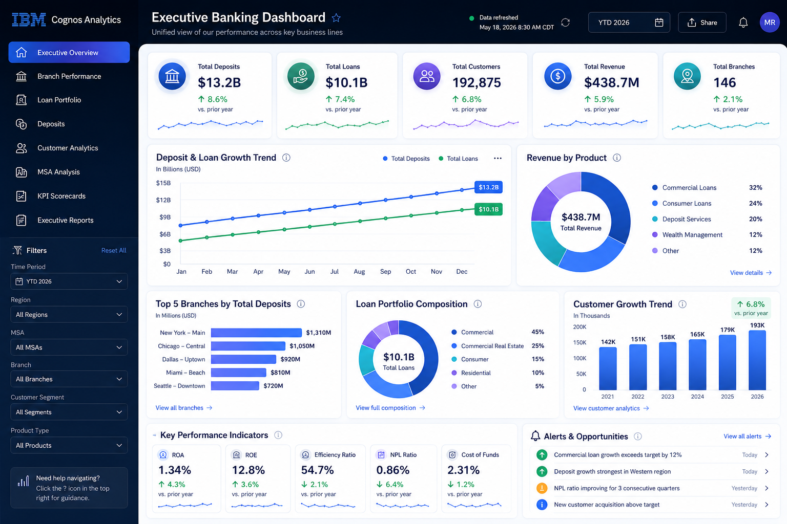

# ✦ IBM Cognos Executive Analytics

A unified executive reporting experience built with IBM Cognos Analytics to transform complex banking data into clear, interactive, and decision-ready insights.

<p align="center">
  
</p>

<p align="center">
<strong>IBM Cognos Analytics</strong> • <strong>Business Intelligence</strong> • <strong>Executive Reporting</strong> • <strong>Banking Analytics</strong> • <strong>Data Visualization</strong>
</p>

---

# 👋 Overview

Modern banking generates an enormous amount of operational and financial data across branches, customers, deposits, loans, and executive reporting systems.

While the data exists, decision-makers often struggle to access the right information quickly enough to support strategic planning.

This project explores how a unified executive analytics dashboard built in **IBM Cognos Analytics** can consolidate critical banking metrics into one interactive reporting experience.

Instead of navigating multiple reports, executives can monitor organizational performance through a collection of integrated dashboard views designed specifically for leadership, business managers, and decision-makers.

---

# 🔒 Portfolio & Confidentiality

> [!IMPORTANT]
> The dashboards, reports, layouts, and visualizations shown in this repository have been recreated exclusively for my professional portfolio.

The original work involved confidential banking information, proprietary reporting logic, internal financial metrics, and sensitive customer data.

To protect confidentiality:

- Every dashboard has been redesigned.
- All banking data is fictional.
- KPIs have been recreated.
- Customer information is fictional.
- Branch information has been recreated.
- Financial values do not represent production data.
- Screenshots are portfolio recreations rather than production reports.

The objective is to demonstrate reporting strategy, dashboard architecture, user experience, and business intelligence thinking without exposing confidential information.

---

# 🏦 Business Context

Bank executives rely on timely reporting to monitor organizational performance across multiple business areas.

However, critical information is often distributed across disconnected reports, spreadsheets, and operational systems.

Leadership teams need quick answers to questions such as:

- How are deposits changing?
- Which branches are outperforming expectations?
- What does the current loan portfolio look like?
- Which customer segments are growing?
- Which markets require additional attention?
- Where are operational opportunities emerging?

Rather than requiring leaders to assemble these insights manually, this project brings them together into one centralized reporting experience.

---

# 🎯 The Challenge

Traditional reporting environments often create several challenges:

- Reports scattered across multiple systems
- Manual spreadsheet preparation
- Inconsistent KPIs
- Limited executive visibility
- Difficult branch comparisons
- Time-consuming report generation
- Limited drill-down capabilities
- Slow identification of business trends
- Difficulty tracking organizational performance

Decision-makers need answers—not dozens of disconnected reports.

---

# 💡 Solution

The dashboard consolidates executive reporting into one interactive IBM Cognos Analytics experience.

The reporting environment includes multiple dashboard views accessible through a single interface.

Key reporting areas include:

- ✅ Executive Financial Dashboard
- ✅ Branch Performance Dashboard
- ✅ Loan Portfolio Dashboard
- ✅ Deposit Analytics
- ✅ Customer Analytics
- ✅ KPI Scorecards
- ✅ Market (MSA) Analysis
- ✅ Executive Reports
- ✅ Scheduled Reports
- ✅ Interactive Drill-Through Reporting

Together, these views provide leadership with a complete picture of organizational performance.

---

# 👩‍💼 My Role

My responsibilities focused on transforming business requirements into executive reporting solutions.

This included:

- Gathering reporting requirements from business stakeholders
- Designing executive dashboard layouts
- Building IBM Cognos Analytics reports
- Developing KPI scorecards
- Creating interactive filtering experiences
- Designing drill-through navigation
- Organizing banking metrics into meaningful reporting sections
- Supporting executive reporting initiatives
- Improving report usability
- Standardizing financial reporting across dashboards

---

# 🖥 Dashboard Experience

Rather than creating separate standalone reports, the project brings multiple analytical views together within a unified executive dashboard.

Each tab focuses on a specific business function while maintaining a consistent navigation and reporting experience.

---

## Executive Dashboard

Provides a high-level snapshot of organizational performance.

Typical KPIs include:

- Total Deposits
- Total Loans
- Portfolio Growth
- Revenue
- Branch Performance
- Customer Growth
- Monthly Trends
- Performance Indicators

Designed for executives who need immediate visibility into business performance.

---

## Branch Performance Dashboard

Compares operational performance across branches.

Potential insights include:

- Branch rankings
- Deposit growth
- Loan growth
- Customer activity
- Regional comparisons
- Operational trends

Interactive filtering allows leaders to quickly identify high-performing and underperforming branches.

---

## Loan Portfolio Dashboard

Provides visibility into lending activity across the organization.

Reporting may include:

- Loan portfolio composition
- Outstanding balances
- Growth trends
- Product mix
- Portfolio distribution
- Loan performance

The dashboard helps leadership monitor lending activity from multiple perspectives.

---

## Deposit Dashboard

Provides insights into deposit performance.

Potential metrics include:

- Deposit balances
- Growth trends
- Deposit mix
- Historical comparisons
- Branch-level deposits
- Market comparisons

---

## Customer Analytics

Consolidates customer-related reporting into one analytical view.

Examples include:

- Customer growth
- New customers
- Customer segmentation
- Retention trends
- Product relationships
- Customer distribution

---

## MSA Analysis

Market-level reporting enables leadership to compare business performance across Metropolitan Statistical Areas (MSAs).

The dashboard supports:

- Geographic comparisons
- Market growth
- Regional opportunities
- Performance benchmarking

---

## KPI Scorecards

Executives often require concise performance summaries.

Scorecards provide:

- Current KPI values
- Target comparisons
- Variance indicators
- Performance status
- Trend indicators

This enables rapid performance assessment without reviewing detailed reports.

---

## Executive Reports

Standardized executive reporting packages provide consistent business updates for leadership meetings and strategic reviews.

Reports emphasize:

- Accuracy
- Consistency
- Readability
- Decision support

---

## Scheduled Reporting

Routine reporting is automated through IBM Cognos scheduling capabilities.

Benefits include:

- Reduced manual effort
- Consistent report delivery
- Timely executive updates
- Improved reporting efficiency

---

## Drill-Through Reporting

Interactive drill-through functionality allows users to move naturally from summary metrics into detailed operational information.

This supports:

- Root-cause analysis
- Performance investigation
- Exception review
- Faster decision-making

---

# ⚙ Reporting Workflow

```text
Core Banking Systems
            ↓
Enterprise Data Sources
            ↓
IBM Cognos Analytics
            ↓
Data Modeling
            ↓
Dashboard Views
            ↓
Interactive Filters
            ↓
Executive Insights
            ↓
Business Decisions
```

---

# 🎨 Design Principles

The dashboard emphasizes clarity over complexity.

Design decisions include:

- Executive-first layouts
- Consistent KPI placement
- Clear visual hierarchy
- Interactive filtering
- Meaningful drill-downs
- Minimal visual clutter
- Fast information discovery
- Standardized color usage
- Consistent navigation across tabs

The objective is to reduce cognitive effort while improving decision quality.

---

# 📈 Business Value

A unified executive dashboard can help organizations:

- Reduce manual reporting effort
- Improve executive visibility
- Standardize KPIs
- Accelerate reporting
- Improve branch comparisons
- Enhance financial transparency
- Support strategic planning
- Enable faster business decisions
- Increase reporting consistency
- Reduce spreadsheet dependency

---

# 🌱 Key Learnings

This project reinforced several important principles.

### Executive dashboards should answer questions—not simply display charts.

### Reporting consistency builds organizational trust.

### Effective dashboards prioritize business decisions over visual complexity.

### Interactivity should simplify exploration rather than overwhelm users.

### Business intelligence is most valuable when it turns fragmented information into a single source of truth.

---

# 🛠 Tools & Technologies

| Area | Focus |
|------|------|
| Business Intelligence | IBM Cognos Analytics |
| Data Visualization | Executive Dashboards |
| Analytics | Banking Performance Analysis |
| Reporting | Executive Reporting |
| Dashboard Design | Interactive KPI Dashboards |
| User Experience | Drill-through Navigation |
| Domain | Banking & Financial Analytics |

---

# 📁 Repository Structure

```text
IBM-Cognos-Executive-Analytics/
│
├── README.md
│
└── assets/
    ├── hero-dashboard.png
    ├── executive-dashboard.png
    ├── branch-performance.png
    ├── loan-portfolio.png
    ├── deposits.png
    ├── customer-analytics.png
    ├── msa-analysis.png
    ├── kpi-scorecards.png
    └── drill-through.png
```

---

# 🌐 Connect

- 🌐 Portfolio: https://mansirathi.framer.ai
- 💼 LinkedIn: https://linkedin.com/in/mansirathi
- 📂 GitHub: https://github.com/heymansirathi

---

> Great reporting doesn't just explain what happened.  
> It gives leaders the confidence to decide what happens next.
